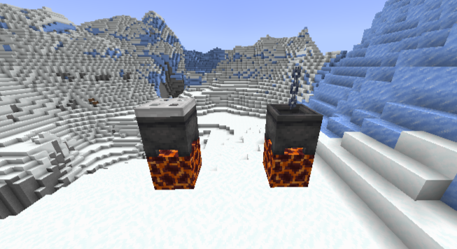
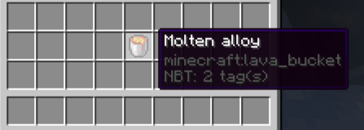
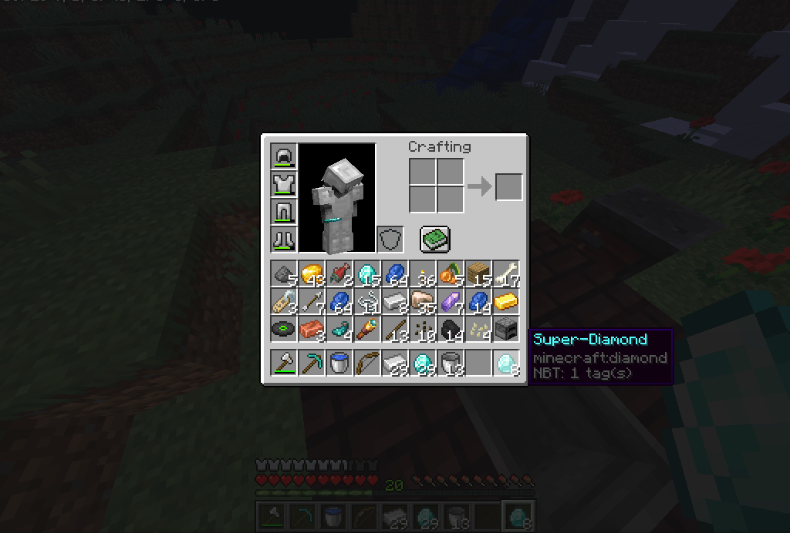
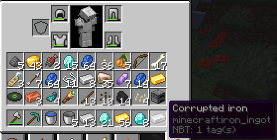

# Blacksmithing
A Minecraft 1.18 plugin to create new materials with multi-block structures
## Create new alloys

These structures consist of an iron trap door or a chain on a cauldron. Underneath the cauldron there must be a block of magma.
They are used to melt materials to form molten alloys. 
After putting the ingredients of a recipe into the cauldron by right-clicking and waiting, you can right-click on the cauldron with an empty bucket in your hand to collect the molten alloy  
You can right-click with a clock on the cauldron to see how long ago you started putting the ingredients in

## Recipes
The allowed materials for the recipes are stored in a file named 'blacksmithing_materials.txt'. In this file, each material is on a line, and the name of the material must be the precise name they are given in the [Material](https://hub.spigotmc.org/javadocs/bukkit/org/bukkit/Material.html) enum.
You can't use an empty bucket or a clock as an ingredient.
**Example file :**
```
COAL
COPPER_INGOT
IRON_INGOT
GOLD_INGOT
REDSTONE
LAPIS_LAZULI
DIAMOND
NETHERITE_INGOT
```
  
To create a recipe, you need to create a file named 'blacksmithing_recipes.txt' in the server folder.  
Each line of the file contains one recipe.  
There is 5 parts in the recipe, separated by ':' :
- The first part is a comma-separated list of items. Each item is composed of a number of items to be used, a space and the material of the item (the material has to be in 'blacksmithing_materials.txt').
- The duration in milliseconds
- The duration margin of error in milliseconds. For example, if the duration is 30000 (=30s) and the margin of error is 5000 (=5s), the player can make the recipe by waiting 25 seconds to 35 seconds
- The name of the result item (supports spaces and bukkit color codes)
- The material of the result item
### Examples
```
5 diamond,2 iron:60000:10000:§r§bSuper-Diamond:DIAMOND
2 iron,1 gold,1 diamond:30000:5000:§r§7Corrupted iron:IRON_INGOT
```
### Results of the examples


## Custom crafts
The custom crafts are stored in a file named 'blacksmithing_crafts.txt' that you have to create.  
Each craft is on a line, there is 4 parts in each craft, separated by ':' :
 - The name of the result item (supports spaces and bukkit color codes)
 - The material of the result item
 - A comma-separated list of 9 materials, the material can be a normal material or the name of a custom material created with a blacksmithing recipe
 - A comma-separated list of attributes for the craft result item : [Attribute](https://hub.spigotmc.org/javadocs/spigot/org/bukkit/attribute/Attribute.html) name and the value, separated by a '='. You can also change the durability of the item with 'DURABILITY' attribute (has to be the first attribute)   
### Examples 
```
§r§1Super-Super-Diamond:DIAMOND:,,,§r§bSuper-Diamond,§r§bSuper-Diamond,§r§bSuper-Diamond,,,:
§r§bSuper-Chestplate:DIAMOND_CHESTPLATE:DIAMOND,,DIAMOND,DIAMOND,§r§bSuper-Diamond,DIAMOND,DIAMOND,DIAMOND,DIAMOND:DURABILITY=1000,GENERIC_KNOCKBACK_RESISTANCE=2,GENERIC_MAX_HEALTH=20
§r§bSuper-Sword:DIAMOND_SWORD:,§r§bSuper-Diamond,,,§r§bSuper-Diamond,,,STICK,:GENERIC_ATTACK_DAMAGE=30
```