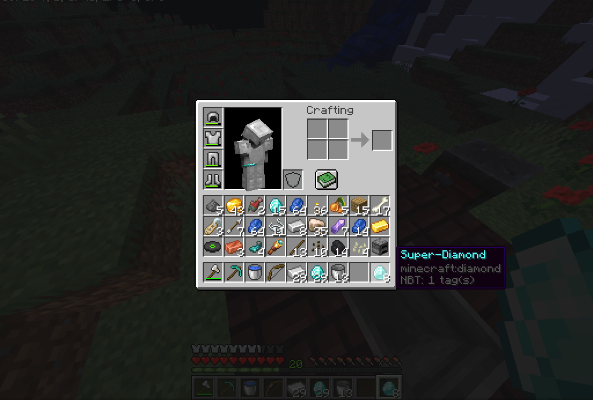
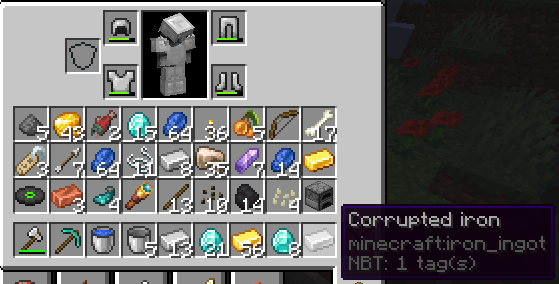

# Blacksmithing
A Minecraft 1.18 plugin to create new materials with multi-block structures
## Screenshots


## Recipes
To create a recipe, you need to create of file named 'blacksmithing_recipes.txt' in the server folder.  
Each line of the file contains one recipe.  
There is 5 parts in the recipe, separated by ':' :  
- The first part is a comma-separated list of items. Each item is composed of a number of items to be used, a space and the name of the item (for now you can only choose from this list 'coal', 'copper',' iron', 'gold', 'redstone', 'lapis', 'diamond' and 'netherite', but that will change).
- The duration in milliseconds
- The duration margin of error in milliseconds. For example, if the duration is 30000 (=30s) and the margin of error is 5000 (=5s), the player can make the recipe by waiting 25 seconds to 35 seconds
- The name of the result item (supports spaces and bukkit color codes)
- The material of the result item
### Examples
```
5 diamond,2 iron:5000:5000:§r§bSuper-Diamond:DIAMOND
2 iron,1 gold,1 diamond:5000:5000:§r§7Corrupted iron:IRON_INGOT
```
### Results of the examples


